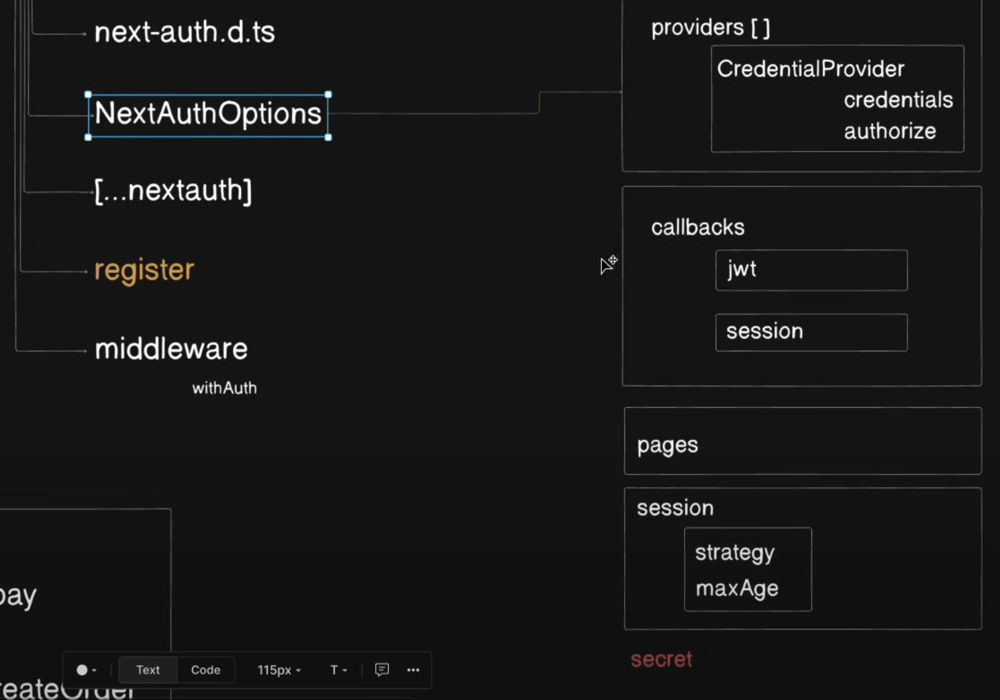

# Social Media App (Reels)

## Tech

- Typescript
- Next.js
- NextAuth - Authentication
- Imagekit.io - Media (videos)
- MongoDB - Database

## Steps

1. Connect app with DB (MongoDB) using caching pattern - [BLOG](https://medium.com/@turingvang/next-js-beginner-mongodb-crud-example-tutorial-db2afdb68e25)
2. Create user & video models - [docs](https://mongoosejs.com/docs/typescript/schemas.html#separate-document-interface-definition)
3. `api/auth/register` route creation + tests (optional, used GPT)
4. Auth Setup using `Next Auth` - [docs](https://next-auth.js.org/configuration/initialization)
    1. `next-auth.d.ts` (customise docs code)
    2. `auth.ts` (auth options config)
    3. `api/[...nextauth]/route.js` (next auth api route)

## Points to keep in mind

- follow proper folder structure
- in express we just connect to DB only once but nextjs runs in edge - that's why we use `caching pattern` for DB connection
- `NextAuth` is designed by keeping **database session storage strategy**

## TODOs

- fix all eslint warning for ts types

## Ref pics / mental model

- NextAuth Flow
  

- Auth Options Configuration
    - providers[]
        - CredentialsProvider()
            - authorise()
    - callbacks{}
        - jwt({token, user})
        - session({session, token(if using `jwt` strategy)})
    - sessions{}
        - strategy (`"jwt"` or `"database"`)
        - maxAge
    - pages{}
    - secret
